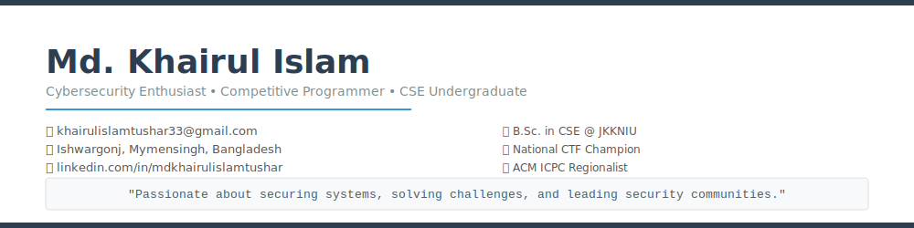

  

 

  
  
  
  

---

## 📋 Summary

Motivated Computer Science undergraduate with strong experience in cybersecurity and competitive programming. Achieved top rankings in multiple national and international CTFs, including **11th place with bounty at HackerOne Bug Hunt 2026** and **Top 100 at Black Hat CTF**. Skilled in penetration testing, bug bounty, reverse engineering, web security, and OSINT, with proficiency in C/C++, Python, and Java. Passionate about applying offensive security skills in cloud-native and security-focused communities.

---

## 🛠 Skills

### Technical Skills

| Category | Skills |
|----------|--------|
| **Penetration Testing** | Web Security, Network Security, Vulnerability Assessment |
| **Reverse Engineering** | Binary Analysis, Malware Analysis, Debugging |
| **OSINT** | Open-Source Intelligence, Reconnaissance, Social Engineering |
| **Tools** | Wireshark, Burp Suite, Nmap, Metasploit, Binary Ninja |
| **Languages** | C, C++, Python, Java, PHP, JavaScript |
| **Operating Systems** | Kali Linux, Windows |

### Soft Skills

| Skill | Description |
|-------|-------------|
| **Leadership** | Successfully led cybersecurity teams in competitions. President of JKKNIU Cyber Security Club, Former Director of Professional Development Service, Rtr. JKKNIU |
| **Problem Solving** | Strong analytical thinking and problem-solving capabilities. Solved 150+ problems on LeetCode, 550+ on Codeforces (max rating 1087), 2★ in CodeChef |
| **Communication** | Effective communicator in team settings, ensuring clear understanding of goals and processes |

---

## 📜 Certifications

| Certification | Issuer | Date | ID |
|---------------|--------|------|-----|
| **eJPT** — Junior Penetration Tester | INE | March 2026 | 176301104 |
| **Mastering Cyber Threat Intelligence for SOC Analysts** | SOCRadar | July 2025 | aa899e7c-4619-4898-896a-f0de19b14f62 |
| **Blue Team Junior Analyst** | Security Blue Team | July 2025 | 7713344076 |

---

## 🎓 Education

| Degree | Institution | Duration | Result |
|--------|-------------|----------|--------|
| **B.Sc. in Computer Science & Engineering** | Jatiya Kabi Kazi Nazrul Islam University | Feb 2023 – Present | CGPA: 3.65 |
| **Higher Secondary Certificate (HSC)** | Agricultural University College, Mymensingh | Jul 2019 – Apr 2021 | GPA: 5.00 |
| **Secondary School Certificate (SSC)** | Mollickpur Laksmiganj High School, Ishwargonj | Feb 2019 | GPA: 5.00 |

---

## 🏆 Contests & Awards

### CTF & Bug Bounty

| Competition | Rank / Award | Date |
|-------------|:------------:|:----:|
| 🥇 **National Robo Fest 2026** — East West University | **Champion** | Jun 2026 |
| 💰 **HackerOne Bug Hunt 2026** (Onsite) | **11th + Bounty** | Jan 2026 |
| 🌍 **Black Hat CTF** — Bugcrowd | **Top 100** | Aug 2025 |
| 🏅 **Cyber Hackathon 2025 Final** | **4th / 35 Teams** | May 2025 |
| 🏅 **Cisco National Skills Competition 2025** | **5th / 30 Teams** | Nov 2025 |
| 🏅 **Red Sentry CTF 2025** | **5th / 50+ Participants** | Jun 2025 |
| 🏅 **Cyber Invasion 2025** — TechnoNext | **7th / 70 Participants** | Dec 2025 |
| 🏅 **BUP CTF** — Knight Squad | **7th / 40 Teams** | |
| 🏅 **DIU CyberCon 2025** | **12th / 35 Teams** | |
| 🏅 **EWU CTF Final** | **12th / 40 Teams** | |
| 🏅 **BUET CTF 2026** | **14th / 35 Teams** | |
| 🏅 **Phoenix Summit CTF 2025** | **17th / 140+ Teams** | |
| 🏅 **MIST Cyber Raid** | **23rd / 40 Teams** | |
| 🏅 **Al-Khwarizmi Science Fest CTF 2026** | **23rd / 45 Teams** | |
| 🏅 **BUP Cipher Sprint 2025** | **23rd / 30 Teams** | |
| 🏅 **NSU Cyber Nauts 2026 Final** | **39th / 60 Teams** | |
| 🏅 **Phoenix Summit CTF 2024 Qualifier** | **74th / 250+ Participants** | |
| 🏅 **Knight CTF 2025** | **147th / 750+ Teams** | |

### Programming & Hackathons

| Contest | Rank |
|---------|:----:|
| 🏅 **ACM ICPC 2025** | Regionalist |
| 🏅 **AUST IUPC 2025** | 73rd / 130+ Teams |
| 🏅 **11th IUT IUPC 2024** | 75th / 120+ Teams |
| 🏅 **NSU Web Extreme Hackathon** | Participant |
| 🏅 **EWU National Hackathon 2024** | Participant |

---

## 💻 Competitive Programming

| Platform | Handle | Stats |
|----------|--------|-------|
| **Codeforces** | [Ki6uiPar1na](https://codeforces.com/profile/Ki6uiPar1na) | 550+ Problems Solved · Max Rating 1087 |
| **LeetCode** | [Ki6uiPar1na](https://leetcode.com/Ki6uiPar1na) | 150+ Problems Solved |
| **CodeChef** | [ki6uipar1na](https://www.codechef.com/users/ki6uipar1na) | 2★ Rating |

---

## 🚀 Projects

### Kingdom Of Soldier
**Python**

A game development project built using Python.

### Mid-Day Programming Club Official App
**Java, Firebase**

Official Android application for the Mid-Day Programming Club at JKKNIU.

### Attendance Management System for JKKNIU
**React Native, MongoDB**

A cross-platform attendance management system for the university.

---

## 👥 Organizations

| Organization | Position | Duration |
|--------------|----------|----------|
| **JKKNIU Cyber Security Club** | President | 2025 – 2026 |
| **JKKNIU Cyber Security Club** | Public Relations Officer | 2024 – 2025 |
| **Mid-Day Programming Club, JKKNIU** | Senior Executive | 2026 – 2027 |
| **Mid-Day Programming Club, JKKNIU** | Executive | 2025 – 2026 |
| **Rotaract Club of JKKNIU** | Director of Professional Development Service | 2024 – 2025 |

---

## 📚 Courses

| Course | Platform |
|--------|----------|
| Practical SOC Analyst | maikroservice Academy |

---

## 📊 GitHub Stats

---

## 📞 References

**Abu Bakar Siddique** — OSCP, CEH, CRTO
Management Trainee Officer, Dutch-Bangla Bank PLC
📧 absiddique.cse@gmail.com · 📞 01516-175614

**Yousuf Abdullah Fahim** — CEHv12 (practical), ACP, CAP, CNSP
Junior Application Security Engineer, Kerberos
📧 yafa11m1@gmail.com · 📞 01305-153564

---

  
    
  © 2026 Md. Khairul Islam · Built with ❤️ for GitHub

