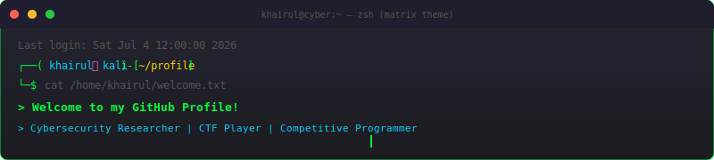
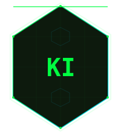
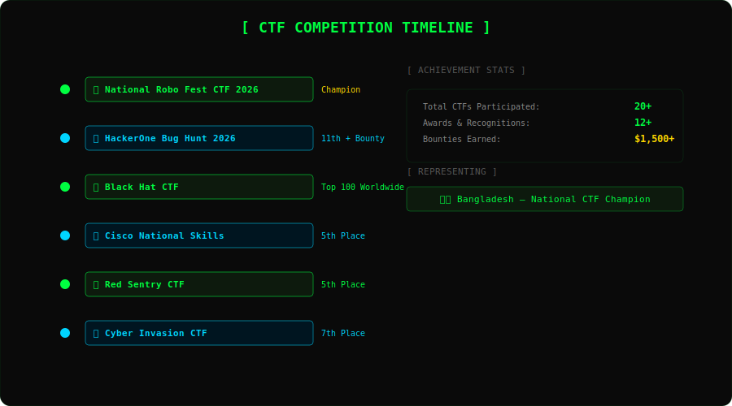

  
   
  

 

<!-- Typing SVG -->

  

<!-- Profile Views & Followers -->

  
  
  

 

<!-- Quick Status Cards -->

  
  
  

---

<!-- ======================================================================== -->
<!-- ABOUT ME SECTION -->
<!-- ======================================================================== -->

<h1 align="center">
  
   
  <code>&gt; whoami</code>
</h1>

  <pre style="background:#0d0d0d; padding: 20px; border-radius: 8px; border: 1px solid #00ff41; font-family: 'Fira Code', monospace; color: #00ff41; text-align: left; max-width: 700px; display: inline-block;">

┌──(khairul@cyber)-[~/about]
└─$ cat about.json

{
  "name": "Md. Khairul Islam",
  "aka": "Ki6uiPar1na",
  "role": "Cybersecurity Researcher",
  "location": "Bangladesh",
  "university": "Jatiya Kabi Kazi Nazrul Islam University",
  "major": "B.Sc. in Computer Science &amp; Engineering",
  "passions": [
    "Web Security",
    "Penetration Testing",
    "Bug Bounty Hunting",
    "Reverse Engineering",
    "Digital Forensics",
    "OSINT",
    "Cloud Security"
  ],
  "interests": ["CTF Competitions", "CP", "Open Source", "Security Research"],
  "status": "Active",
  "motto": "Hack the Planet, Secure the Future."
}

┌──(khairul@cyber)-[~/about]
└─$ _
  </pre>

 

<!-- About Me Cards -->

  <table>
    <tr>
      <td width="33%" align="center">
         
        
          
        <b>🎓 CSE Undergraduate</b>
          
        
          B.Sc. in Computer Science &amp; Engineering from JKKNIU. Passionate about building secure systems and breaking into them first.
        
          
      </td>
      <td width="33%" align="center">
         
        
          
        <b>🛡️ Security Researcher</b>
          
        
          Specializing in web security, penetration testing, and vulnerability research. CTF champion with a hunger for zero-days.
        
          
      </td>
      <td width="33%" align="center">
         
        
          
        <b>💻 CP Enthusiast</b>
          
        
          ACM ICPC Regionalist with 700+ problems solved across Codeforces, LeetCode, and CodeChef.
        
          
      </td>
    </tr>
  </table>

---

<!-- ======================================================================== -->
<!-- CYBERSECURITY ARSENAL -->
<!-- ======================================================================== -->

<h2 align="center">
  <code>&gt; cybersecurity_arsenal/</code>
  
</h2>

  <table>
    <tr>
      <th colspan="2" align="center">
        
        SECURITY TOOLKIT
        
      </th>
    </tr>
    <tr>
      <td align="center" width="33%">
        <b>🔍 Reconnaissance</b>  
        
        
        
        
      </td>
      <td align="center" width="33%">
        <b>💥 Exploitation</b>  
        
        
        
        
      </td>
      <td align="center" width="33%">
        <b>🔬 Analysis</b>  
        
        
        
        
      </td>
    </tr>
    <tr>
      <td align="center">
        <b>🌐 Web Security</b>  
        
        
        
        
      </td>
      <td align="center">
        <b>🐚 OSINT</b>  
        
        
        
        
      </td>
      <td align="center">
        <b>🖥️ Platforms</b>  
        
        
        
        
      </td>
    </tr>
  </table>

 

<!-- Penetration Testing Methodology -->

  
<b>📋 Penetration Testing Methodology</b>

   
  

    <pre style="background:#0d0d0d; padding: 15px; border-radius: 8px; border: 1px solid #00ff41; color: #00ff41; font-family: 'Fira Code', monospace; font-size: 12px; text-align: left; display: inline-block;">
# 7-Phase Penetration Testing Methodology
1. Reconnaissance     →  Information gathering, OSINT, passive recon
2. Scanning            →  Port scanning, service detection, vulnerability scanning
3. Enumeration         →  Deep service enumeration, user/domain discovery
4. Exploitation        →  Vulnerability exploitation, initial foothold
5. Post-Exploitation   →  Privilege escalation, lateral movement
6. Persistence         →  Backdoor installation, maintaining access
7. Reporting           →  Documentation, remediation recommendations
    </pre>
  

---

<!-- ======================================================================== -->
<!-- PROGRAMMING SKILLS -->
<!-- ======================================================================== -->

<h2 align="center">
  <code>&gt; programming_skills/</code>
</h2>

  <h3>
    
    Languages
  </h3>

  

    

  <h3>
    
    Web &amp; Frameworks
  </h3>

  

    

  <h3>
    
    DevOps &amp; Tools
  </h3>

  

    

  <h3>
    
    Cybersecurity Specific
  </h3>

  

    

  <!-- Skill Progress Bars -->
  <table>
    <tr>
      <th colspan="2" align="center">📊 PROFICIENCY LEVELS</th>
    </tr>
    <tr>
      <td width="50%">
        <b>C / C++</b> 
        <progress value="85" max="100" style="width: 100%; height: 8px; border-radius: 4px; background: #1a1a1a; accent-color: #00ff41;"></progress>
        85%
      </td>
      <td width="50%">
        <b>Python</b> 
        <progress value="90" max="100" style="width: 100%; height: 8px; border-radius: 4px; background: #1a1a1a; accent-color: #00d4ff;"></progress>
        90%
      </td>
    </tr>
    <tr>
      <td>
        <b>Web Security</b> 
        <progress value="80" max="100" style="width: 100%; height: 8px; border-radius: 4px; background: #1a1a1a; accent-color: #00ff41;"></progress>
        80%
      </td>
      <td>
        <b>Reverse Engineering</b> 
        <progress value="65" max="100" style="width: 100%; height: 8px; border-radius: 4px; background: #1a1a1a; accent-color: #00d4ff;"></progress>
        65%
      </td>
    </tr>
    <tr>
      <td>
        <b>Penetration Testing</b> 
        <progress value="75" max="100" style="width: 100%; height: 8px; border-radius: 4px; background: #1a1a1a; accent-color: #00ff41;"></progress>
        75%
      </td>
      <td>
        <b>Digital Forensics</b> 
        <progress value="60" max="100" style="width: 100%; height: 8px; border-radius: 4px; background: #1a1a1a; accent-color: #00d4ff;"></progress>
        60%
      </td>
    </tr>
    <tr>
      <td>
        <b>OSINT</b> 
        <progress value="70" max="100" style="width: 100%; height: 8px; border-radius: 4px; background: #1a1a1a; accent-color: #ffd700;"></progress>
        70%
      </td>
      <td>
        <b>Bug Bounty</b> 
        <progress value="75" max="100" style="width: 100%; height: 8px; border-radius: 4px; background: #1a1a1a; accent-color: #ffd700;"></progress>
        75%
      </td>
    </tr>
  </table>

---

<!-- ======================================================================== -->
<!-- CERTIFICATIONS -->
<!-- ======================================================================== -->

<h2 align="center">
  <code>&gt; certifications/</code>
</h2>

  <table>
    <tr>
      <td align="center" width="33%">
         
        
          
        ✅ eJPT
          
        eLearnSecurity Junior Penetration Tester
          
        INE / eLearnSecurity
          
      </td>
      <td align="center" width="33%">
         
        
          
        🔵 Blue Team Jr.
          
        Blue Team Junior Analyst Security Operations
          
        Security Blue Team
          
      </td>
      <td align="center" width="33%">
         
        
          
        🕵️ SOC Analyst
          
        Mastering Cyber Threat Intelligence for SOC
          
        LinkedIn Learning
          
      </td>
    </tr>
  </table>

---

<!-- ======================================================================== -->
<!-- CTF ACHIEVEMENTS -->
<!-- ======================================================================== -->

<h2 align="center">
  <code>&gt; ctf_achievements/</code>
  
</h2>

  

 

<h3 align="center">
  🏆 CTF Competition Record
</h3>

  | Competition | Achievement | Rank | 
  |------------|------------|:----:|
  | 🏆 National Robo Fest CTF 2026 | 🥇 **Champion** | **#1** |
  | 💰 HackerOne Bug Hunt 2026 | 🏅 Bounty Winner | **#11** |
  | 🌍 Black Hat CTF | 🌐 Top 100 Worldwide | **Top 100** |
  | 📡 Cisco National Skills CTF | 🏅 Finalist | **#5** |
  | 🔴 Red Sentry CTF | 🏅 Finalist | **#5** |
  | 💀 Cyber Invasion CTF | 🏅 Finalist | **#7** |
  | 🏛️ BUET CTF | 🏅 Competitor | **#14** |
  | ⚔️ Knight CTF | 🏅 Competitor | **Top 150** |
  | 🐞 HackerOne Hacker CTF | 🏅 Competitor | **Top 20%** |
  | 🔐 BSides CTF | 🏅 Competitor | **Top 30** |

 

<!-- CTF Stats Cards -->

  <table>
    <tr>
      <td align="center" width="25%">
         
        🥇
         
        Champion
         
        National CTF
         
      </td>
      <td align="center" width="25%">
         
        12+
         
        Awards
         
        CTF Competitions
         
      </td>
      <td align="center" width="25%">
         
        $1.5K+
         
        Bounties
         
        Bug Bounty Earnings
         
      </td>
      <td align="center" width="25%">
         
        20+
         
        CTFs Played
         
        And Counting...
         
      </td>
    </tr>
  </table>

---

<!-- ======================================================================== -->
<!-- COMPETITIVE PROGRAMMING -->
<!-- ======================================================================== -->

<h2 align="center">
  <code>&gt; competitive_programming/</code>
</h2>

  <table>
    <tr>
      <th align="center" width="33%">
        
         
        Codeforces
      </th>
      <th align="center" width="33%">
        
         
        LeetCode
      </th>
      <th align="center" width="33%">
        
         
        CodeChef
      </th>
    </tr>
    <tr>
      <td align="center">
        
      </td>
      <td align="center">
        
      </td>
      <td align="center">
        <table>
          <tr><td align="center">550+ Problems Solved</td></tr>
          <tr><td align="center">150+ LeetCode Solved</td></tr>
          <tr><td align="center">2★ CodeChef Rating</td></tr>
          <tr><td align="center">🏅 ACM ICPC Regionalist</td></tr>
        </table>
      </td>
    </tr>
  </table>

---

<!-- ======================================================================== -->
<!-- FEATURED PROJECTS -->
<!-- ======================================================================== -->

<h2 align="center">
  <code>&gt; featured_projects/</code>
</h2>

  <table>
    <tr>
      <td width="50%" align="center" style="border: 1px solid #00ff41; border-radius: 8px; padding: 15px;">
         
        
          
        <b>🎯 Attendance Management System</b>
          
        
          A cross-platform mobile application built with React Native and MongoDB for managing student attendance with real-time tracking, analytics, and notification features.
        
          
        
          React Native • MongoDB • Node.js • Firebase
        
          
        
          
      </td>
      <td width="50%" align="center" style="border: 1px solid #00d4ff; border-radius: 8px; padding: 15px;">
         
        
          
        <b>📱 Mid-Day Programming Club App</b>
          
        
          Official Android application for the Mid-Day Programming Club featuring coding challenges, event management, resource sharing, and community engagement features.
        
          
        
          Java • Firebase • Android SDK
        
          
        
          
      </td>
    </tr>
    <tr>
      <td width="50%" align="center" style="border: 1px solid #ffd700; border-radius: 8px; padding: 15px;">
         
        
          
        <b>🎮 Kingdom Of Soldier</b>
          
        
          A 2D strategy game built in Python with custom game mechanics, level progression system, and engaging gameplay. Demonstrates OOP principles and game development skills.
        
          
        
          Python • Pygame • OOP
        
          
        
          
      </td>
      <td width="50%" align="center" style="border: 1px solid #ff79c6; border-radius: 8px; padding: 15px;">
         
        
          
        <b>🔐 Coming Soon</b>
          
        
          A cybersecurity tool currently in development. More details will be revealed upon release. Stay tuned for cutting-edge security solutions.
        
          
        
          Python • Security • Research
        
          
        
          
      </td>
    </tr>
  </table>

---

<!-- ======================================================================== -->
<!-- OPEN SOURCE CONTRIBUTIONS -->
<!-- ======================================================================== -->

<h2 align="center">
  <code>&gt; open_source/</code>
</h2>

  | Repository | Description | 
  |------------|-------------|
  | 🔧 [Awesome Cybersecurity Tools](https://github.com/Ki6uiPar1na) | Curated list of cybersecurity tools for penetration testing and bug bounty |
  | 📖 [CTF Writeups](https://github.com/Ki6uiPar1na) | Collection of CTF competition writeups and solutions |
  | 🧠 [CP Solutions](https://github.com/Ki6uiPar1na) | Competitive programming solutions across multiple platforms |
  | 🛠️ [Security Scripts](https://github.com/Ki6uiPar1na) | Collection of automation scripts for security research |
  | 🌐 [Portfolio Website](https://github.com/Ki6uiPar1na) | Personal portfolio and blog on cybersecurity topics |

---

<!-- ======================================================================== -->
<!-- LEADERSHIP -->
<!-- ======================================================================== -->

<h2 align="center">
  <code>&gt; leadership/</code>
</h2>

  <table>
    <tr>
      <td width="50%" align="center" style="border: 1px solid #00ff41; border-radius: 8px; padding: 20px;">
         
        
          
        👑 President
          
        JKKNIU Cyber Security Club
          
        
          Leading Bangladesh's premier university cybersecurity club. Organizing CTF competitions, workshops, and training sessions. Building a community of ethical hackers and security researchers.
        
          
        2025 — Present
          
      </td>
      <td width="50%" align="center" style="border: 1px solid #00d4ff; border-radius: 8px; padding: 20px;">
         
        
          
        📢 Public Relations Officer
          
        JKKNIU Cyber Security Club
          
        
          Managed external communications, partnerships, and publicity for club events. Established connections with industry professionals and cybersecurity organizations.
        
          
        2024 — 2025
          
      </td>
    </tr>
    <tr>
      <td width="50%" align="center" style="border: 1px solid #ffd700; border-radius: 8px; padding: 20px;">
         
        
          
        💻 Senior Executive
          
        Mid-Day Programming Club
          
        
          Mentored junior members in competitive programming. Organized coding contests, workshops, and practice sessions. Fostered a culture of algorithmic problem-solving.
        
          
        2024 — Present
          
      </td>
      <td width="50%" align="center" style="border: 1px solid #ff79c6; border-radius: 8px; padding: 20px;">
         
        
          
        🔄 Director
          
        Rotaract Club
          
        
          Directed community service initiatives and leadership development programs. Coordinated events promoting social welfare and professional growth among members.
        
          
        2024 — Present
          
      </td>
    </tr>
  </table>

---

<!-- ======================================================================== -->
<!-- GITHUB STATISTICS -->
<!-- ======================================================================== -->

<h2 align="center">
  <code>&gt; github_statistics/</code>
</h2>

 

  <!-- GitHub Stats -->
  <table>
    <tr>
      <td width="50%" align="center">
        
      </td>
      <td width="50%" align="center">
        
      </td>
    </tr>
  </table>

   

  <!-- GitHub Streak -->
  

    

  <!-- GitHub Trophies -->
  

    

  <!-- Activity Graph -->
  

 

<!-- 3D Contribution Calendar -->

  
<b>🌌 3D Contribution Calendar (Expand)</b>

   
  

    
      
    
  

---

<!-- ======================================================================== -->
<!-- CONTRIBUTION SNAKE -->
<!-- ======================================================================== -->

<h2 align="center">
  <code>&gt; contribution_snake/</code>
  
</h2>

  

---

<!-- ======================================================================== -->
<!-- COMPETITIVE PROGRAMMING WIDGETS -->
<!-- ======================================================================== -->

<h2 align="center">
  <code>&gt; competitive_programming_stats/</code>
</h2>

  <table>
    <tr>
      <td align="center" width="50%">
        
      </td>
      <td align="center" width="50%">
        
      </td>
    </tr>
  </table>

---

<!-- ======================================================================== -->
<!-- CONNECT -->
<!-- ======================================================================== -->

<h2 align="center">
  <code>&gt; connect_with_me/</code>
</h2>

  <table>
    <tr>
      <td align="center">
        
      </td>
      <td align="center">
        
      </td>
      <td align="center">
        
      </td>
      <td align="center">
        
      </td>
      <td align="center">
        
      </td>
      <td align="center">
        
      </td>
      <td align="center">
        
      </td>
    </tr>
  </table>

   

  <!-- Contact Details -->
  <table>
    <tr>
      <td align="center" width="50%">
        📧 Email
         
        <a href="mailto:khairulislamtushar33@gmail.com">
          khairulislamtushar33@gmail.com
        </a>
      </td>
      <td align="center" width="50%">
        📍 Location
         
        Bangladesh
      </td>
    </tr>
  </table>

---

<!-- ======================================================================== -->
<!-- SUPPORT / DONATION -->
<!-- ======================================================================== -->

<h2 align="center">
  <code>&gt; support/</code>
</h2>

  <table>
    <tr>
      <td align="center">
        
      </td>
    </tr>
  </table>

---

<!-- ======================================================================== -->
<!-- BLOG / LATEST (optional) -->
<!-- ======================================================================== -->

<h2 align="center">
  <code>&gt; latest_content/</code>
</h2>

  <table>
    <tr>
      <td align="center" width="50%">
        <b>📰 Latest Blog Posts</b>
          
        Blog posts coming soon...
          
        Stay tuned for cybersecurity writeups and tutorials
      </td>
      <td align="center" width="50%">
        <b>📺 YouTube / Content</b>
          
        Content coming soon...
          
        CTF walkthroughs and security tutorials
      </td>
    </tr>
  </table>

---

<!-- ======================================================================== -->
<!-- VISITOR COUNTER & FOOTER -->
<!-- ======================================================================== -->

  <!-- Visitor Counter -->
  

    

  

    

  <!-- Matrix Footer Animation -->
  <pre style="background:#0a0a0a; padding: 15px; border-radius: 8px; border: 1px solid #00ff41; color: #00ff41; font-family: 'Courier New', monospace; display: inline-block; text-align: left; font-size: 12px;">
┌──────────────────────────────────────────────┐
│   💻 "Hack the Planet, Secure the Future."   │
│         ⭐ Thanks for visiting! ⭐           │
└──────────────────────────────────────────────┘
  </pre>

   

  <!-- Animated Matrix Text -->
  

    
      &gt; _  system.ready() →  Awaiting next challenge...
    
  

  <!-- Cursor Blink Effect -->
  _

    

  <!-- Bottom Badges -->
  
  
  

---

<!-- ======================================================================== -->
<!-- HIDDEN: CAN BE USED VIA WIDGETS FOLDER -->
<!-- ======================================================================== -->

<!--
Widget files for external rendering are located in the widgets/ directory:
  - widgets/github-stats.md
  - widgets/codeforces.md
  - widgets/leetcode.md
  - widgets/hackerone.md
  - widgets/ctftime.md
-->

<!--
GitHub Actions workflows for auto-updating metrics:
  - .github/workflows/snake.yml
  - .github/workflows/metrics.yml
  - .github/workflows/activity.yml
  - .github/workflows/achievements.yml
-->
